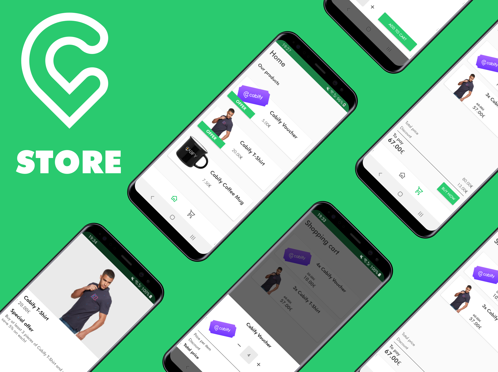
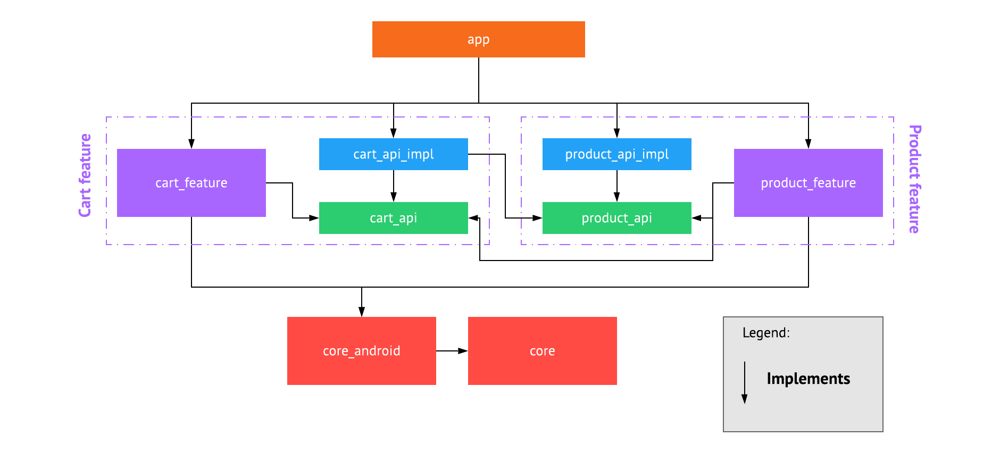
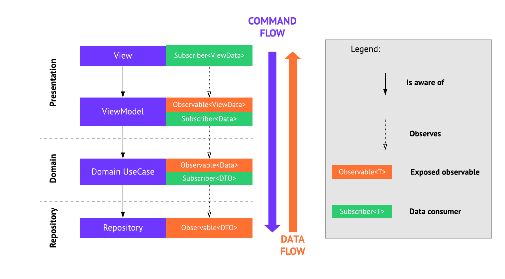

# CabiStore

Hello and welcome to the first and only Cabify Store Android native app! This app allows you to browse our store and buy amazing cabify-branded products for the best price on the market. 

## CabiStore Features
CabiStore app is the only place you can find all our products for unbeatable prices! We give special offers only to our app users so don't hesitate and get the app today!

As a sneak peek, we can tell you that you'll find amazing offer for cabify rides in a form of 5€ voucher. With every voucher, you'll get second one **TOTALLY FOR FREE**. To show your real love with Cabify we also offer you amzing deal on Cabify T-Shirts! Get at least three of them and you'll get 5% off on each piece! Get them for you and your friends and do your next cabify ride in style! And we have prepared for you even more*! Get the app now to see all the amazing stuff ready for you!   

As a bonus, for our hardcode fans and users, we've made our app open source! Now you can have your own CabiStore customized into last detail just for you. Check out the code and enjoy what we've done for you. But before that, we advice you to read following techinical details section to understand what you're about to experience.

# Technical details

## Architecture
Codebase is separated into three main layers:  

* Repository
* Domain
* Presentation

You'll find multiple modules included in the project. Here's brief description:

* `app` main project module gluing everything together. This is the place where main component and whole lifecycle of the app is managed from.
* `core` module which purpose is to share feature independent source code between other modules. It's plain java module with no dependency on android framework.
* `core_android` has same purpose as `core` but depends on android framework and thus can provide shared code between modules which are android based as well.
* `*_api` plain java modules which contain interfaces and data models for domain and repository layers of specific features.
* `*_api_impl`plain java module implementing feature's `*_api` interfaces.
* `*_feature` android module containg presentation layer of specific feature.

*Pro tip: To understand code faster, start with `*_api` and `*_api_impl` modules, followed by `*_feature` and then see how it's glued in `app`.*

You may be asking why such separation. For me this has been proven concept of android app modularization which brings multiple benefits:

* Speeds up development in team-per-feature environment.
* Enforces writing code in a clean and organized way.
* Makes it easy to add new features on top of exiting codebase.
* Optimizes build speed of the project.
* Code is easily testable.
* Makes all android devs happy.

Actual diagram of all modules in the project:

### Layers and flows

As mentioned earlier, architecture consists of three main layers - repository, domain, presentation. For ever feature, repository and domain can be found in `*_api` and `*_api_impl` modules, while presentation layer is always in `*_feature` modules. Please have a look at following graphical representation of communication between layers:

Following rules apply:

* From the two neighbour layers, only top one knows about the one below it. Top layer keeps reference to the layer below it and can call it's methods directly.
* From the two neighbour layers, bottom layer has no knowledge about layer above it. Bottom layer exposes observable data stream which top layer is observing.
* Communication is done always only between two neighbour layers.

### Dependency injection

This section should make clear decisions made for dagger graph. There are four main components:

* **AppComponent** - is the only component which is alive during whole lifecycle of the app.
* **UserSessionComponent** - component which should be created for specific user session. This is not very visible in current implementation as there's no real user handling. For better understanding, for example cart (represented by CartRespository) should be created and destroyed with user session. We can also consider every running UI tests as a separate user session. With every tests we start new user session which effectively clears any previous user's state.
* **CartComponent** and **ProductComponent** - feature components which hold dependencies specifically for those features.

### FAQ
**Why are there `*_api` and `*_api_impl` modules? Wouldn't be `*_api` which includes also implementation enough?**  
No. One module wouldn't be enough. This separation allows you to use single `*_api` in multiple `*_api_impl` modules. If you had single `api` module per feature you would be not be able to share functionality in both directions. Imagine cart feature needs to read products but also products needs to have access to cart. With single `*_api` you would end up with circular dependency, but with separation you can implement two `*_api` modules in single `*_api_impl`.

**Why are `*_api` and `*_api_impl` plain java modules?**  
This makes build time lower but mainly, android framework has nothing to do in domain and repository layers.

## Testing
### Unit tests
Implemented architecture allows testing of repository, use cases and view models without need of any instrumentation of android emulation (e.g. robolectric). This way unit tests run fast and reliably.

Views testing could be done using instrumentation or robolectric, but that seems unnecessary as UI tests were implemented as well.

### UI tests
UI tests are running using instrumentation. Thanks to architecture and dependency scoping it's easy to fulfill preconditions for the tests as we can mock certain dependencies or replace whole graph altogether. 

## Dependencies
(Those worth mentioning and their reasoning)

* **Dagger** - selected as it's industry standard nowadays and I have the most experience with. Other alternative could be for example koin which would work just fine as this is purely kotlin based project.
* **RxJava** - used across all modules in the project which makes it hard to replace by anything else. But just like DI, there has to be decision made which tool to use. Alternative would be coroutines but I selected RxJava due it's versatility and my experience.
* **lifecycle-extensions** - for ViewModels and LiveData which play well with android framework and view's lifecycle. Top layer - presentation is using LiveData instead of rxJava for simplifying lifecycle handling without necesity of writing any additional boilerplate.
* **Navigation components** - doesn't make that much sense with only 2 desitnations currently in the project, but helps scale up easily.
* **Retrofit** - another industry standard, for networking this time. Something simple as OkHttp client would be enough for the single API call in the app, but it would not scale in future.
* **Espresso** - standard for android UI testing. Makes it easy to write UI tests and it's the fastest way of executing them. Alternative would be for example appium, which on one hand allows reuse tests on iOS as well, but execution is way slower.
* **MockWebServer** - helps scale UI tests easily. This spins up local server which app is making requests against. Alternative would be mocking specific repositories/api interfaces during tests which is more tidious and it also skips production code which is replaced by mocks.

